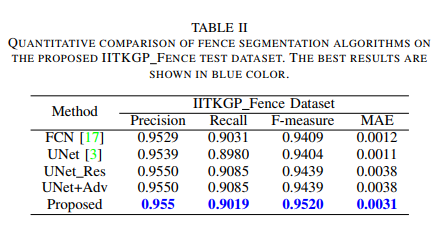

# Occlusion-Removal
Occlusion Removal from a Single Image

<h2>
Deep Generative Adversarial Network for Occlusion Removal from a Single Image
</h2>

[Sankaraganesh Jonna](https://www.linkedin.com/in/ganeshjonna/), [Moushumi Medhi], [Rajiv Ranjan Sahay](https://www.iitkgp.ac.in/department/EE/faculty/ee-rajiv)

    

 

This repository provides access to the IITKGP_Fence dataset used in the [paper](https://arxiv.org/abs/placeholder)
🚀 Explore the dataset [via this link](https://huggingface.co/datasets/NeuroVizv0yaZ3R/IITKGP_Fence_dataset).

# IITKGP_Fence dataset
The dataset consists of images containing fence-like occlusions along with the ground truth annotations. We created the ground truth labels in a semi-automatic way with user interaction. 

  <picture>
    
  </picture>

# Eval

  <picture>
    
  </picture>

# Contact Us
medhi.moushumi@iitkgp.ac.in
